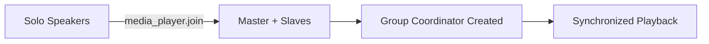

# WiiM Integration - Multiroom Group Behavior

Deep dive into how WiiM multiroom groups work in Home Assistant.

## Understanding Multiroom Concepts

### Group Roles

Every WiiM speaker has one of three roles:

| Role       | Description         | Behavior                                     |
| ---------- | ------------------- | -------------------------------------------- |
| **Solo**   | Independent speaker | Plays its own content, controls only itself  |
| **Master** | Group coordinator   | Controls group playback, synchronizes slaves |
| **Slave**  | Group member        | Follows master's playback and timing         |

### The Role Sensor

Every WiiM device has a role sensor that's **critical** for understanding group state:

```yaml
sensor.living_room_multiroom_role: "Master"
sensor.kitchen_multiroom_role: "Slave"
sensor.bedroom_multiroom_role: "Solo"
```

**Why This Matters:**

- Automations can target only masters for efficiency
- You can detect group formation/dissolution
- UI can show group relationships clearly

## Group Formation

### Creating Groups

Groups can be formed three ways:

**1. Home Assistant Service**

```yaml
service: media_player.join
target:
  entity_id: media_player.living_room # Becomes master
data:
  group_members:
    - media_player.kitchen
    - media_player.bedroom
```

**2. WiiM Home App**

- Groups created in the app appear in HA automatically
- Changes sync within 5 seconds
- Useful for initial setup and testing

**3. Voice Assistants**

```
"Hey Google, play music on living room and kitchen"
```

### Group Coordinator Entity

When a speaker becomes a master with slaves, a virtual group coordinator entity appears:

```yaml
media_player.living_room_group_coordinator
```

This entity:

- ✅ Only exists when the speaker is actually coordinating a group
- ✅ Provides unified control for the entire group
- ✅ Shows all member states in attributes
- ✅ Automatically appears/disappears with group changes

## Volume Behavior

### How Group Volume Works

WiiM groups maintain **proportional volume relationships**:

```yaml
# Initial state
Living Room: 80% (Master)
Kitchen: 40% (Slave)
Bedroom: 60% (Slave)

# Set group volume to 50%
# Result: All speakers set to 50%
Living Room: 50%
Kitchen: 50%
Bedroom: 50%
```

### Volume Synchronization Types

**1. Absolute Sync (Current Implementation)**

- All speakers set to same volume level
- Simple and predictable
- Best for same-room speakers

**2. Relative Sync (Possible Future)**

- Maintains proportional relationships
- Complex but preserves room balance
- Better for multi-room scenarios

### Individual vs Group Control

```yaml
# Control individual speaker (even in group)
service: media_player.volume_set
target:
  entity_id: media_player.kitchen
data:
  volume_level: 0.3

# Control entire group
service: media_player.volume_set
target:
  entity_id: media_player.living_room_group_coordinator
data:
  volume_level: 0.5
```

## Mute Behavior

### Group Mute Logic

A group is considered muted **only when ALL members are muted**:

| Living Room | Kitchen | Bedroom   | Group Muted? |
| ----------- | ------- | --------- | ------------ |
| Muted       | Muted   | Muted     | ✅ Yes       |
| Muted       | Muted   | Not Muted | ❌ No        |
| Not Muted   | Muted   | Muted     | ❌ No        |

### Mute Operations

```yaml
# Mute entire group
service: media_player.volume_mute
target:
  entity_id: media_player.living_room_group_coordinator
data:
  is_volume_muted: true
# Result: ALL speakers muted

# Unmute group
service: media_player.volume_mute
target:
  entity_id: media_player.living_room_group_coordinator
data:
  is_volume_muted: false
# Result: ALL speakers unmuted
```

## Playback Synchronization

### What's Synchronized

When speakers are grouped:

| Feature         | Synchronized? | Notes                         |
| --------------- | ------------- | ----------------------------- |
| Play/Pause/Stop | ✅ Yes        | All speakers act together     |
| Track Position  | ✅ Yes        | Perfect sync within ~20ms     |
| Track Selection | ✅ Yes        | Next/previous affects all     |
| Source          | ✅ Yes        | All play same source          |
| Volume          | ❌ No         | Individual control maintained |
| EQ Settings     | ❌ No         | Per-speaker settings          |

### Source Behavior

When a slave tries to change source:

1. Slave automatically leaves the group
2. Slave switches to requested source
3. Slave becomes solo

```yaml
# This causes kitchen to leave group
service: media_player.select_source
target:
  entity_id: media_player.kitchen # Currently a slave
data:
  source: "Bluetooth"
```

## Group Lifecycle

### Formation



### Dissolution Triggers

Groups dissolve when:

1. **Master Goes Offline**

   - All slaves return to solo mode
   - Playback may continue individually
   - Group coordinator becomes unavailable

2. **All Slaves Leave**

   - Master returns to solo mode
   - Group coordinator becomes unavailable

3. **Explicit Ungroup**

   ```yaml
   service: media_player.unjoin
   target:
     entity_id: media_player.living_room_group_coordinator
   ```

4. **Network Issues**
   - Lost connectivity breaks sync
   - Speakers continue playing cached content
   - Group reforms when network returns

## State During Transitions

### Role Change Timeline

```
Time | Event | Living Room Role | Kitchen Role | Group Entity
-----|-------|------------------|---------------|-------------
0s   | Initial | Solo | Solo | Unavailable
1s   | Join command | Solo→Master | Solo→Slave | Unavailable
2s   | Group formed | Master | Slave | Available
3s   | Playback starts | Master | Slave | Playing
...  | ... | ... | ... | ...
60s  | Leave command | Master→Solo | Slave→Solo | Unavailable
```

### Handling State Changes

```yaml
automation:
  - alias: "Monitor Group Changes"
    trigger:
      - platform: state
        entity_id: sensor.living_room_multiroom_role
    action:
      - choose:
          - conditions:
              - condition: template
                value_template: "{{ trigger.to_state.state == 'Master' }}"
            sequence:
              - service: notify.mobile_app
                data:
                  message: "Living Room is now controlling a group"
          - conditions:
              - condition: template
                value_template: "{{ trigger.from_state.state == 'Master' and trigger.to_state.state == 'Solo' }}"
            sequence:
              - service: notify.mobile_app
                data:
                  message: "Living Room group dissolved"
```

## Network Requirements

### Multicast Traffic

Groups require multicast communication:

- **Protocol**: UDP multicast
- **Ports**: 49152-65535 (dynamic)
- **TTL**: Must be > 1 for multi-hop networks

### Bandwidth Usage

| Activity          | Bandwidth per Speaker |
| ----------------- | --------------------- |
| Idle (grouped)    | ~1 KB/s               |
| Playing (grouped) | ~5 KB/s               |
| Sync negotiation  | ~50 KB/s (burst)      |

### Latency Requirements

For good synchronization:

- **LAN Latency**: < 5ms between speakers
- **Jitter**: < 2ms variation
- **Packet Loss**: < 0.1%

## Best Practices

### 1. Group Similar Speakers

- Same model/firmware version work best together
- Mixed models may have slight sync drift
- Group speakers in same room or area

### 2. Network Optimization

```yaml
# Use DHCP reservations
Living Room: 192.168.1.50
Kitchen: 192.168.1.51
Bedroom: 192.168.1.52
```

### 3. Automation Patterns

**Always Control Via Master**

```yaml
# Good - controls entire group
service: media_player.media_play
target:
  entity_id: >
    {{ states.media_player
       | selectattr('attributes.group_role', 'eq', 'master')
       | map(attribute='entity_id') | list }}

# Bad - might miss slaves
service: media_player.media_play
target:
  entity_id: media_player.living_room
```

**Group-Aware Volume**

```yaml
# Reduce volume at night if grouped
service: media_player.volume_set
target:
  entity_id: media_player.bedroom
data:
  volume_level: >
    
      0.3
    
      0.2  {# Lower when part of group #}
    
```

### 4. Error Recovery

```yaml
automation:
  - alias: "Reform Groups After Network Issue"
    trigger:
      - platform: state
        entity_id: binary_sensor.network_connected
        from: "off"
        to: "on"
        for: "00:00:30"
    action:
      - delay: "00:00:30" # Let devices stabilize
      - service: script.restore_speaker_groups
```

## Troubleshooting Groups

### Common Issues

**"Slaves not following master"**

- Check network connectivity
- Verify same firmware versions
- Ensure multicast is enabled

**"Group keeps breaking"**

- WiFi signal strength issues
- DHCP lease renewals
- Power saving modes on router

**"Volume not syncing"**

- Individual volume overrides active
- Check group coordinator entity
- Verify all speakers available

### Debug Information

Check these attributes on the group coordinator:

```yaml
media_player.living_room_group_coordinator:
  group_members:
    - name: "Living Room"
      entity_id: "media_player.living_room"
      volume_level: 0.5
      is_volume_muted: false
      role: "coordinator"
    - name: "Kitchen"
      entity_id: "media_player.kitchen"
      volume_level: 0.5
      is_volume_muted: false
      role: "member"
```

## Advanced Scenarios

### Dynamic Group Assignment

```yaml
# Create different groups based on time
automation:
  - alias: "Adaptive Grouping"
    trigger:
      - platform: time
        at: "08:00:00"
    action:
      - choose:
          # Weekday morning - just kitchen
          - conditions:
              - condition: time
                weekday: [mon, tue, wed, thu, fri]
            sequence:
              - service: media_player.unjoin
                target:
                  entity_id: all
          # Weekend morning - full house
          - conditions:
              - condition: time
                weekday: [sat, sun]
            sequence:
              - service: media_player.join
                target:
                  entity_id: media_player.kitchen
                data:
                  group_members:
                    - media_player.living_room
                    - media_player.patio
```

### Group Templates

```yaml
# Input select for group presets
input_select:
  speaker_groups:
    name: Speaker Group Presets
    options:
      - "All Solo"
      - "Downstairs"
      - "Whole House"
      - "Party Mode"
    initial: "All Solo"

# Automation to apply presets
automation:
  - alias: "Apply Speaker Group Preset"
    trigger:
      - platform: state
        entity_id: input_select.speaker_groups
    action:
      - service: script.apply_speaker_group
        data:
          preset: "{{ trigger.to_state.state }}"
```

## Performance Considerations

### Polling Optimization

The integration uses adaptive polling:

- **Playing Groups**: 1-second updates
- **Idle Groups**: 5-second updates
- **User Commands**: Immediate refresh

### Scalability

| Group Size    | Performance Impact       |
| ------------- | ------------------------ |
| 2-3 speakers  | Negligible               |
| 4-6 speakers  | Minimal (< 1% CPU)       |
| 7-10 speakers | Noticeable (2-3% CPU)    |
| 10+ speakers  | Consider multiple groups |

### Entity Count

With groups enabled:

- Each speaker: 2 media players (individual + group coordinator)
- Plus: 1 role sensor per speaker
- Total: 3N entities for N speakers

## Future Enhancements

Potential improvements being considered:

1. **Relative Volume Sync** - Maintain proportional volumes
2. **Sub-Groups** - Groups within groups
3. **Scene Integration** - Save/restore group configurations
4. **Auto-Grouping** - Based on presence/activity
5. **Group Scheduling** - Time-based group formation
